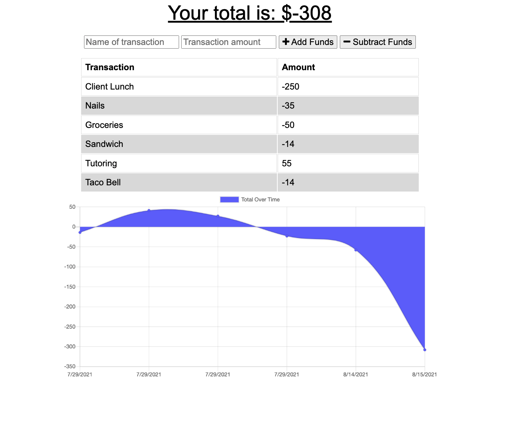

# progressiveBudget

Built by Michael Rao

A web application that allows users to add expenses and deposits to their budget, with or without an internet connection.

# Technologies Used

    - HTML
    - CSS
    - js
    - express.js
    - node.js
    - mongoDb
    - mongoose

# Description

This application allows users to exter expenses and deposits to their budget. A ledger tracks each individual expense, and a total profit/loss is calculated and displayed at the top of the screen. This application can be used either online or offline, as all data and functions are stored in the browser's indexedDB. Offline expenses are stored as "pending", then added to the mongo database when the application comes back online.

# Setup/Installation Requirements

Clone this repository to VS code. Open an integrated terminal from the progressiveBudget folder, and enter "npm start".

Alternatively, the webpage can be accessed on Heroku at https://peaceful-atoll-01297.herokuapp.com/

# Known Bugs

There are no known bugs at this time.

# Licenseß

Copyright (c) 2021 Michael Rao

# Contact Information

Michael Rao jmichaelrao@gmail.com
